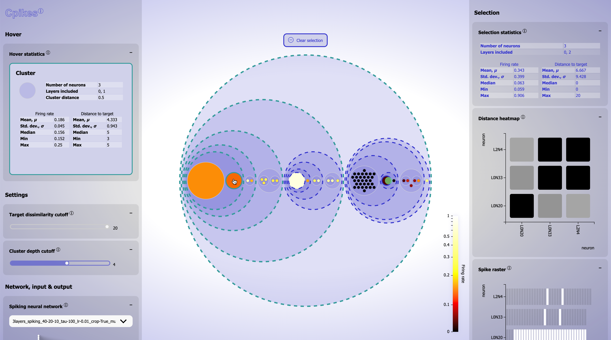

# Cpikes

- **Author**: Linnéa Gustafsson
- **Institution**: KTH Royal Institute of Technology, Stockholm
- **Degree Program**: Master of Science in Computer Science
- **Year**: 2024

This is the repository of the master's thesis *Explainable Spiking Neural Networks for Model Developers Using Interactive Treemapping – A Visual Analytics Design Study in Neuromorphic Computing* by Linnéa Gustafsson, KTH, 2024. The repository constitutes the code of the tool *Cpikes*, a visual analytics tool for Spiking Neural Networks (SNNs).

## Table of Contents
- [Cpikes](#cpikes)
  - [Table of Contents](#table-of-contents)
  - [Algorithm Overview](#algorithm-overview)
  - [Dependencies](#dependencies)
  - [Usage](#usage)
    - [Preprocessing](#preprocessing)
    - [Runtime](#runtime)
  - [Contact Information](#contact-information)

## Algorithm Overview
We summarize the algorithm in three steps:
1. Calculate **FastDTW distances** from the spike trains.
2. Perform **hierarchical clustering** of the distances.
3. Visualize with a **circular treemap**.

Step 1 and 2 is done in the [preprocessing](#preprocessing). During runtime, step 3 is performed (together with supporting elements of the tool).

## Dependencies
- [FastDTW](https://github.com/rmaestre/FastDTW) (fastdtw)
- [Matplotlib](https://github.com/matplotlib/matplotlib) (pyplot)
- [NumPy](https://github.com/numpy/numpy)
- [OpenCV](https://github.com/opencv/opencv-python)
- [pandas](https://github.com/pandas-dev/pandas)
- [Pickle](https://github.com/python/cpython/blob/3.12/Lib/pickle.py)
- [PIL](https://github.com/python-pillow/Pillow) (Image)
- [SciPy](https://github.com/scipy/scipy) (cluster.hierarchy and spatial.distance)

## Usage
First, the data needs to be preprocessed. Once this is done, Cpikes can be run and used.

### Preprocessing
Run [src/data_prep/main.py](src/data_prep/main.py).

This preprocesses the data (*i.e.*, calculates FastDTW distances and performs hierarchical clustering). If processing all files, this takes a while (up to a day). If you just want a smaller example that can be preprocessed in minutes, you can edit [src/data_prep/main.py](src/data_prep/main.py) to run `export_file()` or `export_file_one_test_input()` instead of `export_all()`.

### Runtime
1. Make sure the contents of the file loaded into filenamePath (in src/visualization/main.js) matches the files exported in the preprocessing.
2. Run [src/visualization/index.html](src/visualization/index.html).

## Contact Information
- **Email**: [linnea.gustafsson@hotmail.se](linnea.gustafsson@hotmail.se)
- **LinkedIn**: [https://www.linkedin.com/in/emma-linnéa-gustafsson/](https://www.linkedin.com/in/emma-linn%C3%A9a-gustafsson/)
